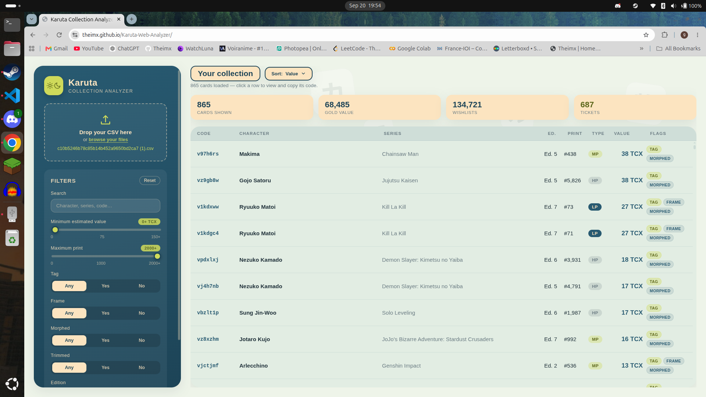
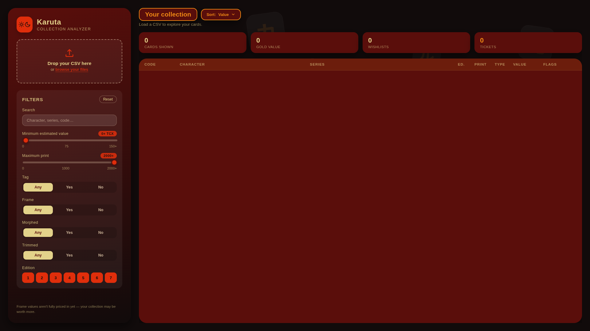

**Language : HTML; CSS; Javascript**  
**Software Version : 1.0**  
**AI : AI used**   

---
### *Description* :   
A website to get statistics on your Karuta card collection from the Discord bot Karuta.   
https://theimx.github.io/Karuta-Web-Analyzer/   
   
---
### *How to use* :   
- Put your CSV File (that you get by doing /Spreadsheet) in the website.   
---
### *Visual* :

   
   
   

   
---
